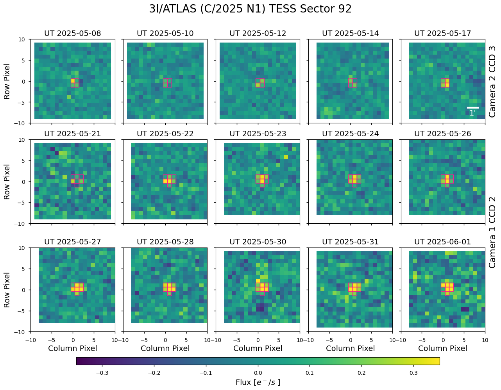
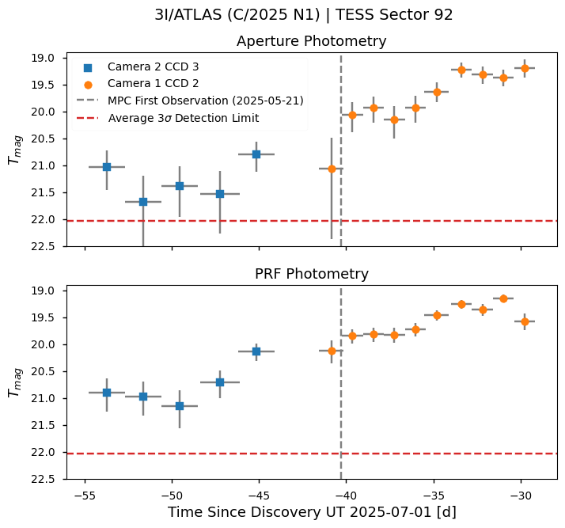

# TESS 3I/ATLAS 

This repository contains the data reduction and analysis used in [Martinez-Palomera et al. (2025)](https://arxiv.org/abs/2508.02499). Here, you'll find dedicated notebooks to do:
* Data retrieval, background modeling, position correction, image stacking, and photometry
* Generation of light curve files and paper figures, [here](notebooks/3i_paper_plots.ipynb).
* Check potential future TESS observations, [here](notebooks/3i_tess_future.ipynb).
* Convert time series file into ADES ready format for MPC submission, [here](notebooks/3i_mpc_xml.ipynb).

    

    

Funding for this work is provided by NASA grants 80NSSC20M0192 and 80GSFC24M0006.