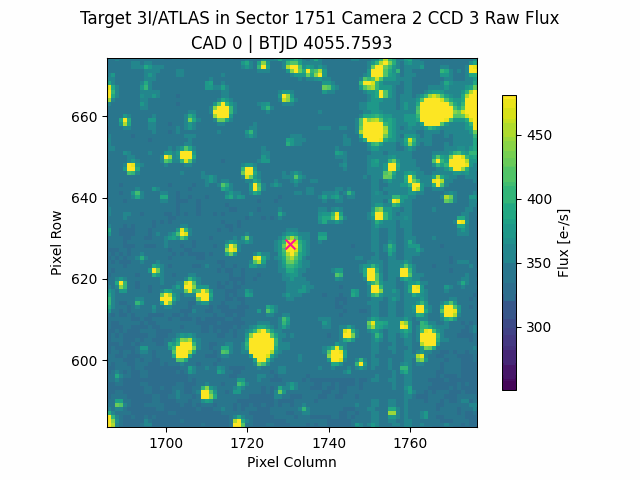
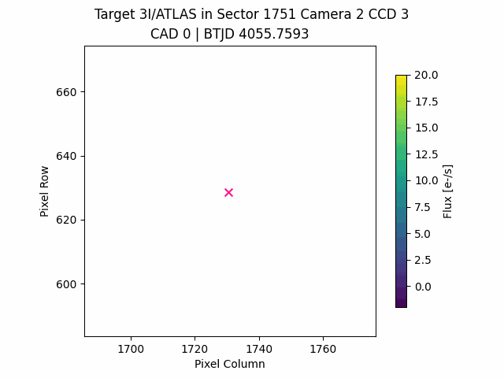
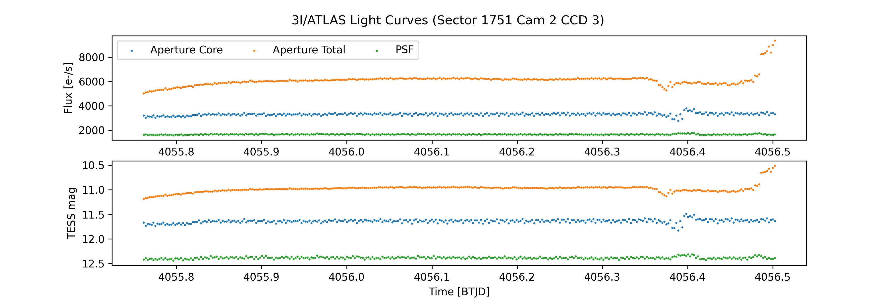
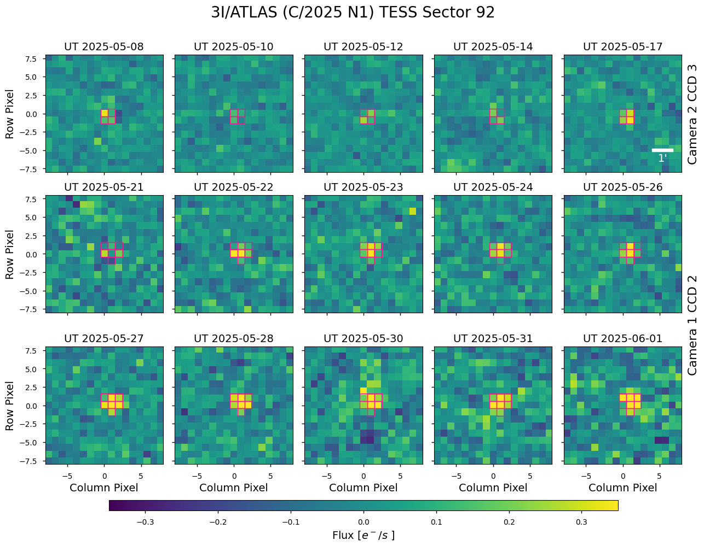
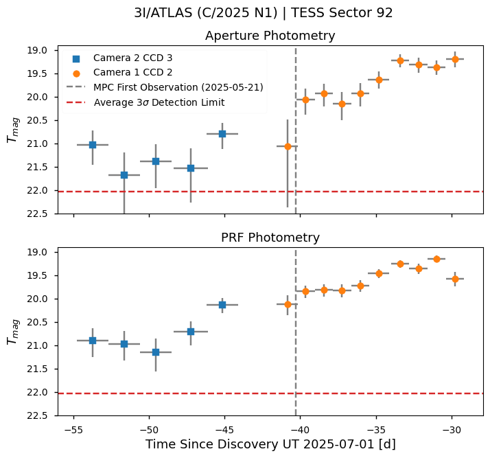

# TESS - 3I/ATLAS 

This repository contains the data reduction and analysis used in [Martinez-Palomera et al. (2025)](https://arxiv.org/abs/2508.02499) and in [Martinez-Palomera et al. (2026, to be submitted)]() for the observations of 3I/ATLAS performed by TESS in 2025 and 2026.

## January 2026 Data

This contains the data reduction performed on the data taken during TESS observations of 3I/ATLAS during sector 1751 between January 16th and 22nd, 2026. 
For further details on TESS sector 1751 observations visit the [TSSC website](https://heasarc.gsfc.nasa.gov/docs/tess/tess-special-news-bulletin-dec-18th.html).

> **As January 23, 2026, only 322 full frame images have been processed by the SPOC pipeline, which correspond to observations between 2026-01-15T06:04:18 and 2026-01-15T23:54:18 UTC.**

The data created here is available in a [Zenodo repository](https://doi.org/10.5281/zenodo.18344942) and it will be updated with new data as soon this is available at the MAST archive. 
We will update these repositories with new data products, figures, and details as more data becomes available at the MAST archive.

Here, you'll find dedicated notebooks to do:
* Create object centered moving TPF from TESS sector 1751 using [tess-asteroids](https://altuson.github.io/tess-asteroids/), which models the scattered background light and star field and extract light curves using aperture and PSF photometry. 
  * [This notebook](notebooks/2026/make_mTPF_from_ffi.ipynb) uses the full frame images.
* [This notebook](notebooks/2026/open_hlsp_data.ipynb) shows of how to open the data-products published in this [Zenodo repository]([to_Zenodo](https://doi.org/10.5281/zenodo.18344942)) using astronomy-related python packages.

This are animations of the TESS observations of 3I/ATLAS with the raw (left) and corrected (right) images. The corrected images are background (scattered light and stars) subtracted. The bright pixels in the field are residuals from the background subtraction, primarily from very bright stars.

    
    

This are the light curves extracted from the data. We defined two aperture masks, one for the core (blue) and another for the core plus tail (orange). Additionally we computed PSF photometry which only accounts for the comet nucleus (green).
The noisier photometric points near BTJD 4056.4 are due to a bright saturated star. The increase in brightness in the total flux (orange) is due to edge effect in the background star model which affected the tail of the comet. 

    

If you have questions regarding data processing, access, content, and suggestions on how to improve them in future versions, contact us through the [TSSC helpdesk](https://heasarc.gsfc.nasa.gov/docs/tess/helpdesk.html), GitHub issues in this repository, or via email.

---

## May 2025 Data

This is the data reduction and analysis used in [Martinez-Palomera et al. (2025)](https://arxiv.org/abs/2508.02499) which used TESS sector 92 data between May 8th and June 1st 2025. 

Here, you'll find dedicated notebooks to do:
* Data retrieval, background modeling, position correction, image stacking, and photometry, [here](notebooks/2025/3i_tess_mtpf.ipynb).
* Generation of light curve files and paper figures, [here](notebooks/2025/3i_paper_plots.ipynb).
* Check potential future TESS observations, [here](notebooks/2025/3i_tess_future.ipynb).
* Convert time series file into ADES ready format for MPC submission, [here](notebooks/2025/3i_mpc_xml.ipynb).

    

    

---
Funding for this work is provided by NASA grants 80NSSC20M0192, 80GSFC24M0006 and the TESS Science Support Center.